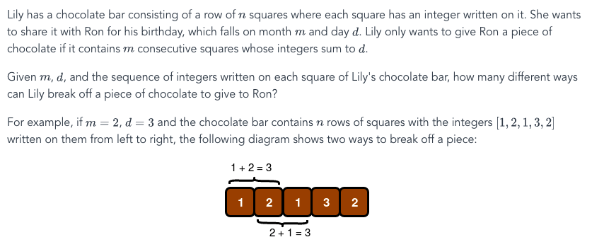
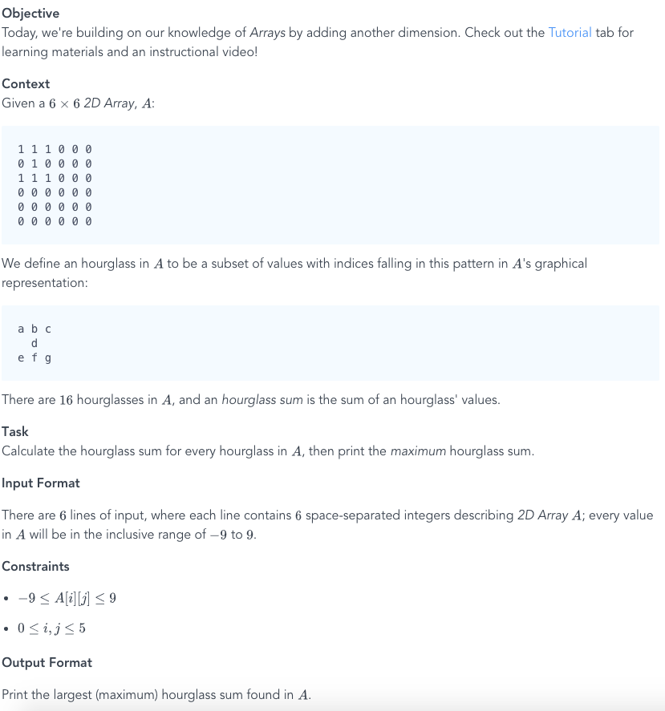
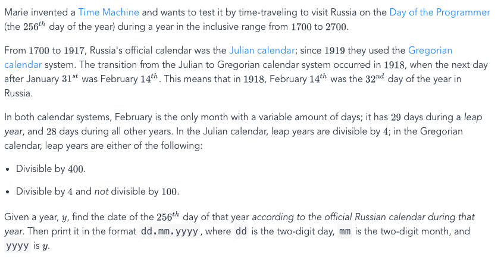
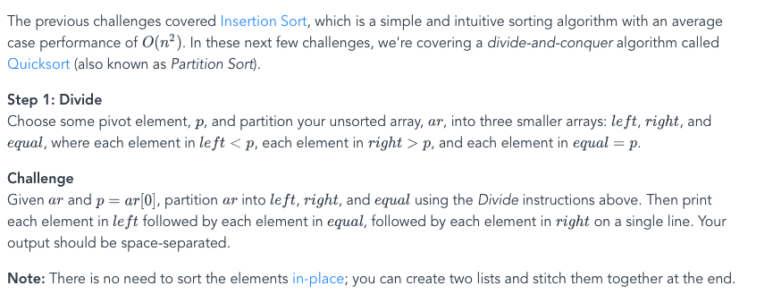
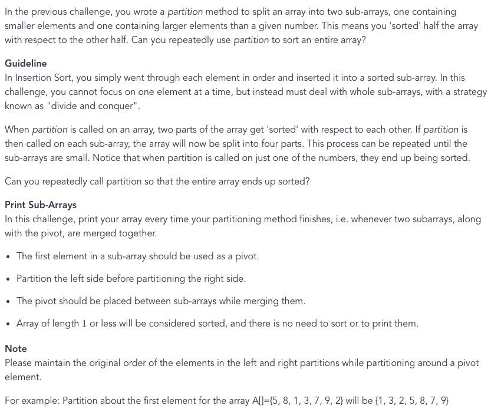
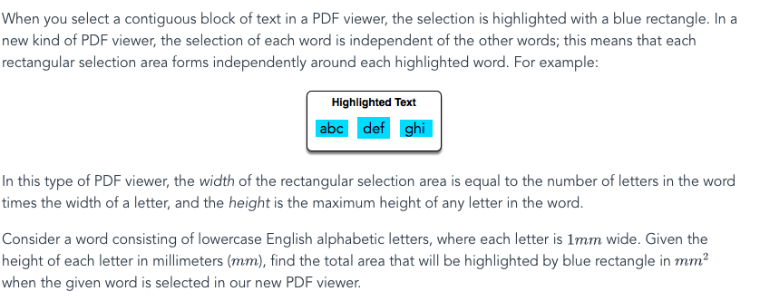
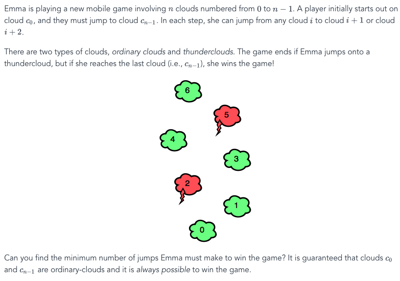
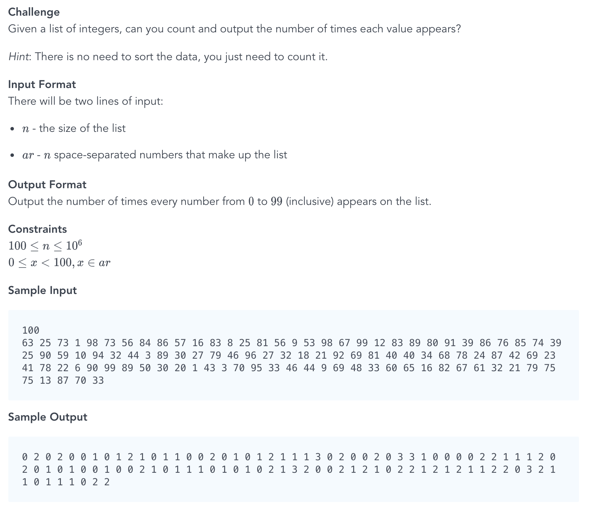
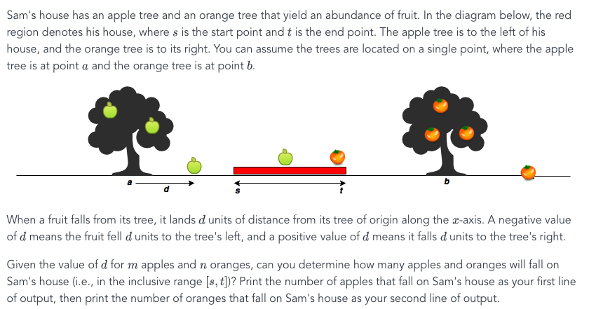
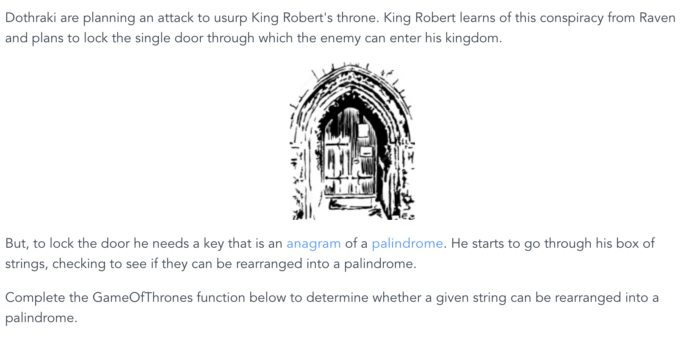

# 100 Days Of Algorithms

### This is my attempt at 100 days of Algorithms 
Note: While doing this challenge, my goal is to learn another program langauge such as C and write algorithms using that new language instead. My goal is to switch the syntax every 20 days of algorithms. #challengeWithATwist

### Start Date: March 13th, 2017

### Log:
- - - -  
### *Java*

<b>Day 0: March 13, 2017</b>

1. [1_simpleSum](https://github.com/wongandydev/100DaysOfAlgorithms/blob/master/Algorithms/1_simpleSum.java): A simple program that takes the sum based on user input, 0 will stop it from adding numbers.

**Day 1: March 14, 2017**

1. [2_solveMeFirst](https://github.com/wongandydev/100DaysOfAlgorithms/blob/master/Algorithms/2_solveMeFirst.java): A simple program that takes two integers and returns a sum.
2. [3_compareTheTriplets](https://github.com/wongandydev/100DaysOfAlgorithms/blob/master/Algorithms/3_compareTheTriplets.java): Takes six integers from users, compares them in a point system to see who has more points.

**Day 2: March 15, 2017**

1. [4_aVeryBigSum](https://github.com/wongandydev/100DaysOfAlgorithms/blob/master/Algorithms/4_aVeryBigSum.java): Take Two inputs, first being the array size, second being the values, values should be larger than 10 digits. 
2. [5_diagonalDifference](https://github.com/wongandydev/100DaysOfAlgorithms/blob/master/Algorithms/5_diagonalDifference.java): Given a square matrix of size *N* calculate the absolute difference between the sums of its diagonals.

**Day 3: March 16, 2017**

1. [6_PlusMinus](https://github.com/wongandydev/100DaysOfAlgorithms/blob/master/Algorithms/6_PlusMinus.java): Given an array of integers, calculate which fraction of its elements are positive, negative, and zeroes, respectively. Print the decimal value of each fraction on a new line, only up to six digits after decimal acceptable
2. [7_Staircase](https://github.com/wongandydev/100DaysOfAlgorithms/blob/master/Algorithms/7_Staircase.java): Observe that its base and height are both equal to <i>N</i> and the image is drawn using # symbols and spaces. The last line is not preceded by any spaces.

**Day 4: March 17, 2017**

1. [8_MiniMaxSum](https://github.com/wongandydev/100DaysOfAlgorithms/blob/master/Algorithms/8_MiniMaxSum.java): Given five positive integers, find the minimum and maximum values that can be calculated by summing exactly four of the five integers. 

**Day 5: March 18, 2017**

1. [9_TimeConversion](https://github.com/wongandydev/100DaysOfAlgorithms/blob/master/Algorithms/9_TimeConversion.java): Convert AM/PM time to military time.

**Day 6: March 19, 2017**

1. [10_ExtraLongFactorials](https://github.com/wongandydev/100DaysOfAlgorithms/blob/master/Algorithms/10_ExtraLongFactorials.java): You are given an integer *N* Print the factorial of this number.

**Day 7: March 20, 2017**

1. [11_AppendAndDelete](https://github.com/wongandydev/100DaysOfAlgorithms/blob/master/Algorithms/11_AppendAndDelete.java): Given two strings and *K* --> Number of Operations. You can do two operations Append or Delete a character. See if you can convert string s to string t with those the given number of operations and using only Append and Delete.

**Day 8: March 21, 2017**

1. [12_SherlockAndSquares](https://github.com/wongandydev/100DaysOfAlgorithms/blob/master/Algorithms/12_SherlockAndSquares.java): Given an integer, which is the number of test cases then two integers *A* and *B*, find the number of square roots in the range of *A* and *B*

**Day 9: March 22, 2017**

1. [13_LibraryFine](https://github.com/wongandydev/100DaysOfAlgorithms/blob/master/Algorithms/13_LibraryFine.java): Calculate fine with given conditions:
	1. If the book is returned on or before the expected return date, no fine will be charged
	2. If the book is returned after the expected return day but still within the same calendar month and year as the expected return date 15 x number of days late
	3. If the book is returned after the expected return month but still within the same calendar year as the expected return date, the 500 x number of months later
	4. If the book is returned after the calendar year in which it was expected, there is a fixed fine of 10000 

**Day 10: March 23, 2017***

1. [14_CutTheSticks](https://github.com/wongandydev/100DaysOfAlgorithms/blob/master/Algorithms/14_CutTheSticks.java):

You are given **N** sticks, where the *length* of each stick is a positive integer. A cut operation is performed on the sticks such that all of them are reduced by the length of the smallest stick.

**Day 11: March 24, 2017***

1. [15_GradingChallenge](https://github.com/wongandydev/100DaysOfAlgorithms/blob/master/Algorithms/15_GradingChallenge.java): 

HackerLand University has the following grading policy:

* Every student receives a *grade* in the inclusive range from **0** to **100**
* Any *grade* less than **40** is a failing grade.

Sam is a professor at the university and likes to round each student's *grade* according to these rules:

* If the difference between the *grade* and the next multiple of **5** is less than **3**, round *grade* up to the next multiple of **5**
* If the value of *grade* is less than **38**, no rounding occurs as the result will still be a failing grade.

For example, *grade* = **84** will be rounded to 85 but *grade* = 29 will not be rounded because the rounding would result in a number that is less than **40**

Given the initial value of *grade* for each of Sam's  students, write code to automate the rounding process. For each , round it according to the rules above and print the result on a new line.

**Day 12: March 25, 2017***

1. [16_SuperReducedString](https://github.com/wongandydev/100DaysOfAlgorithms/blob/master/Algorithms/16_SuperReducedString.java):

Steve has a string,*s*, consisting of *n* lowercase English alphabetic letters. In one operation, he can delete any *pair* of *adjacent letters* with same value. For example, string `"aabcc"` would become either `"aab"` or `"bcc"` after **1** operation.

Steve wants to reduce *s* as much as possible. To do this, he will repeat the above operation as many times as it can be performed. Help Steve out by finding and printing s's non-reducible form!

**Note:** If the final string is empty, print `Empty String`. 

**Day 13: March 26, 2017**

1. [17_Encryption.java](https://github.com/wongandydev/100DaysOfAlgorithms/blob/master/Algorithms/17_Encryption.java):

**Day 14: March 27, 2017***

1. [18_MarsExploration.java](https://github.com/wongandydev/100DaysOfAlgorithms/blob/master/Algorithms/18_MarsExploration.java): Letters in some SOS messages are altered by cosmic radiation during transmission. Given the signal received by Earth as a string, *S* , determine how many letters of SOS have been changed by radiation.

**Day 15: March 28, 2017***

1. [19_HackerrankInAString.java](https://github.com/wongandydev/100DaysOfAlgorithms/blob/master/Algorithms/19_HackerrankInAString.java): Given a string, print `YES` if the string contains 'hackerrank', else print `NO`.

**Day 16: March 29. 2017***

1. [20_Pangrams.java](https://github.com/wongandydev/100DaysOfAlgorithms/blob/master/Algorithms/20_Pangrams.java): Given a sentence, check if it is a Pangram (using every letter in the alphabet). If it does, print `pangram` else print `not pangram`.

**Day --: March 30,2017***
Midterm Studying, did not do daily algorithm due to studying. 

**Day 17: March 31, 2017***

1. [21_WeightedUniformString.java](https://github.com/wongandydev/100DaysOfAlgorithms/blob/master/Algorithms/21_WeightedUniformString.java)

**Day 18: April 1, 2017**

1. [22_FunnyString.java](https://github.com/wongandydev/100DaysOfAlgorithms/blob/master/Algorithms/22_FunnyString.java)

**Day 19: April 2, 2017**

1. [23_Gemstone.java](https://github.com/wongandydev/100DaysOfAlgorithms/blob/master/Algorithms/23_Gemstone.java)

**Day 20: April 3, 2017**

1. [24_AlternatingCharacters.java](https://github.com/wongandydev/100DaysOfAlgorithms/blob/master/Algorithms/24_AlternatingCharacters.java): Given a string, find out the number of deletions required to make the letters in the string consecutive.

### *Python*

**Day 21: April 4, 2017***

1. [25_BeautifulBinary.py](https://github.com/wongandydev/100DaysOfAlgorithms/blob/master/Algorithms/25_BeautifulBinary.py): Given a binary string, you need to make it to a beautiful string. To be considered a beautiful, you cannot have `010`. You are allowed to switch the 0s and 1s to make it a beautiful string. Find the minimum steps it would take to do so.  

**Day 22: April 5, 2017***

1. [26_BreakingTheRecords.py](https://github.com/wongandydev/100DaysOfAlgorithms/blob/master/Algorithms/26_BreakingTheRecords.py)

**Day 23: April 6, 2017***

1. [27_BirthdayChocolate.py](https://github.com/wongandydev/100DaysOfAlgorithms/blob/master/Algorithms/27_BirthdayChocolate.py)

**Day 24: April 7, 2017***

1. [28_DivisibleSumPairs.py](https://github.com/wongandydev/100DaysOfAlgorithms/blob/master/Algorithms/28_DivisibleSumPairs.py)

**Day --: April 8, 2017 --> April 9, 2017**

**Day 25: April 10, 2017***

1. [29_SeperateTheStrings.py](https://github.com/wongandydev/100DaysOfAlgorithms/blob/master/Algorithms/29_SeperateTheStrings.py)

**Day 26: April 11, 2017***

1. [30_BinaryNumbers.py](https://github.com/wongandydev/100DaysOfAlgorithms/blob/master/Algorithms/30_BinaryNumbers.py)

**Day --: April 12, 2017 --> April 17, 2017**: Working on Job Interviews and Coding Challenges 

**Day 27: April 18, 2017**

1. [31_2DArray.py](https://github.com/wongandydev/100DaysOfAlgorithms/blob/master/Algorithms/31_2DArray.py): 

**Day 28: April 19, 2017**

1. [32_BirthdayCakeCandles.py](https://github.com/wongandydev/100DaysOfAlgorithms/blob/master/Algorithms/32_BirthdayCakeCandles.py): Given an input of number of candles and an array of candles. Return the number of candles a child can blow if she can only blow the tallest ones.

**Day 29: April 20, 2017**

1. [33_Inheritance.py](https://github.com/wongandydev/100DaysOfAlgorithms/blob/master/Algorithms/33_Inheritance.py): Given two class, *Person* and *Student*, *Person* is the base class and *Student* is the derived class. Student inherits all properties of Person. Return the char grade with a calculate method. 

**Day 30: April 21, 2017**

1. [34_AbstractClasses.py](https://github.com/wongandydev/100DaysOfAlgorithms/blob/master/Algorithms/34_AbstractClasses.py): 

**Day 31: April 22, 2017**

1. [35_BigSorting.py](https://github.com/wongandydev/100DaysOfAlgorithms/blob/master/Algorithms/35_BigSorting.py):Consider an array of numeric strings, *unsorted* , where each string is a positive number with anywhere from 1 to 10^6 digits. Sort the array's elements in non-decreasing (i.e., ascending) order of their real-world integer values and print each element of the sorted array on a new line.

**Day 32: April 23, 2017**

1. [36_TheLoveLetterMystery.py](https://github.com/wongandydev/100DaysOfAlgorithms/blob/master/Algorithms/)

**Day --: April 24, 2017 --> April 27, 2017**

**Day 33: April 28, 2017**

1. [37_bon-appetit.py](https://github.com/wongandydev/100DaysOfAlgorithms/blob/master/Algorithms/37_bon-appetit.py): Given a list of ordered number, and an item that was not eaten. Calculate if the bill was seperated correctly. [Detailed Prompt Here](http://bit.ly/day33prompt)

**Day --: April 29, 2017 --> May 7, 2017**: Working on prepartion of Finals, and Job Interviews + Coding Challenges 

**Day 34: May 8, 2017**

1. [38_Kangaroo.py](https://github.com/wongandydev/100DaysOfAlgorithms/blob/master/Algorithms/38_Kangaroo.py): There are two kangaroos on an x-axis ready to jump in the positive direction (i.e, toward positive infinity). The first kangaroo starts at location `X1` and moves at a rate of `V1` meters per jump. The second kangaroo starts at location `X2` and moves at a rate of  `V2` meters per jump. Given the starting locations and movement rates for each kangaroo, can you determine if they'll ever land at the same location at the same time?

**Day --: May 9, 2017 --> May 11, 2017**: Finals at School.

**Day 35: May 12, 2017**

1. [39_InsertionSort1.py](https://github.com/wongandydev/100DaysOfAlgorithms/blob/master/Algorithms/39_InsertionSort1.py): Given`e`, the rightmost number in the list, insert it into the list. (`1,2,4,3` --> `1,2,3,4`)

**Day 36: May 13, 2017**

1. [40_InsertionSort2.py](https://github.com/wongandydev/100DaysOfAlgorithms/blob/master/Algorithms/40_InsertionSort2.py): Adding on to previous Insertion sort, now sort an unsorted list. (`2,4,3,1` --> `1,2,3,4`)

**Day 37: May 14, 2017**

1. [41_DayOfTheProgrammer.py](https://github.com/wongandydev/100DaysOfAlgorithms/blob/master/Algorithms/41_DayOfTheProgrammer.py)

**Day 38: May 15, 2017**

1. [42_marcsCakeWalk.py](https://github.com/wongandydev/100DaysOfAlgorithms/blob/master/Algorithms/42_marcsCakeWalk.py)

**Day 39: May 16, 2017**

1. [43_IceCreamParlor.py](https://github.com/wongandydev/100DaysOfAlgorithms/blob/master/Algorithms/43_IceCreamParlor.py)

**Day 40: May 17, 2017**

1. [44_QuickSort.py](https://github.com/wongandydev/100DaysOfAlgorithms/blob/master/Algorithms/44_QuickSort.py): 

### *Javascript*

**Day 41: May 18, 2017***

1. [45_SockMerchant.js](https://github.com/wongandydev/100DaysOfAlgorithms/blob/master/Algorithms/45_SockMerchant.js): 

**Day 42: May 19, 2017**

1. [46_QuickSort2.js](https://github.com/wongandydev/100DaysOfAlgorithms/blob/master/Algorithms/46_QuickSort2.js): 

**Day 43: May 20. 2017***

1. [47_DesignerPDFView.js](https://github.com/wongandydev/100DaysOfAlgorithms/blob/master/Algorithms/47_DesignerPDFView.js):

**Day 44: May 21, 2017***

1. [48_StringConstruction.js](https://github.com/wongandydev/100DaysOfAlgorithms/blob/master/Algorithms/48_StringConstruction.js)

**Day 45: May 22, 2017***

1. [49_MigratoryBirds.js](https://github.com/wongandydev/100DaysOfAlgorithms/blob/master/Algorithms/49_MigratoryBirds.js)

**Day 46: May 23, 2017**

1. [50_JumpingOnTheClouds.js](https://github.com/wongandydev/100DaysOfAlgorithms/blob/master/Algorithms/50_JumpingOnTheClouds.js)

**Day 47: May 24, 2017**

1. [51_Anagram.js](https://github.com/wongandydev/100DaysOfAlgorithms/blob/master/Algorithms/51_Anagram.js) 

**Day 48 - 51: May to June**

Algorithms 52 - 55: 

1. [52_ImplementationTutorialIntro.js](https://github.com/wongandydev/100DaysOfAlgorithms/blob/master/Algorithms/52_ImplementationTutorialIntro.js) 
2. [53_SeperateTheNumber.java](https://github.com/wongandydev/100DaysOfAlgorithms/blob/master/Algorithms/53_SeperateTheNumber.java) 
3. [54_catsAndaMouse.js](https://github.com/wongandydev/100DaysOfAlgorithms/blob/master/Algorithms/54_catsAndaMouse.js) 
4. [55_CountingValleys.js](https://github.com/wongandydev/100DaysOfAlgorithms/blob/master/Algorithms/55_CountingValleys.js)

### *Python*

**Day 52: December 23, 2017**

1. [56_CountingSort1.py](https://github.com/wongandydev/100DaysOfAlgorithms/blob/master/Algorithms/56_CountingSort1.py)

**Day 53: December 25, 2017**

1. [57_apple_and_orange.py](https://github.com/wongandydev/100DaysOfAlgorithms/blob/master/Algorithms/57_apple_and_orange.py)

**Day 54: January 1st, 2018**

1. [58_CountingSort2.py](https://github.com/wongandydev/100DaysOfAlgorithms/blob/master/Algorithms/58_CountingSort2.py): Given an unsorted list of integers, output the integers in order.

**Day 55: March 30th, 2018**

1. [59_GameOfThrones.py](https://github.com/wongandydev/100DaysOfAlgorithms/blob/master/Algorithms/59_GameOfThrones.py)

